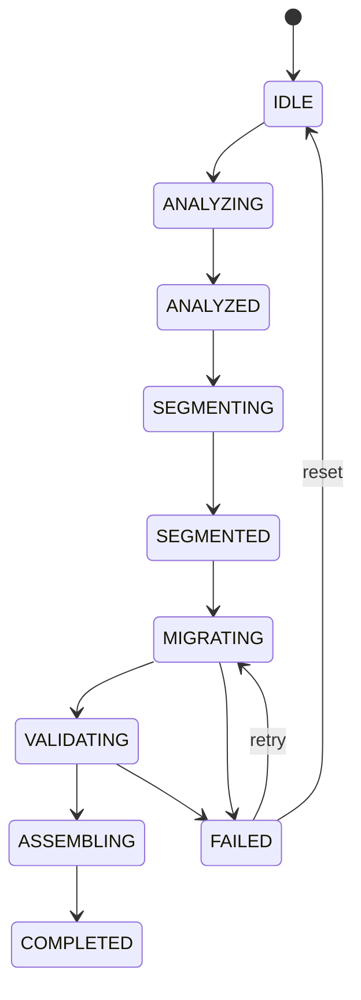

# 🌉 LegacyBridge — Migración Automatizada de Código Legacy

[](https://python.org)
[](#testing)
[](LICENSE)

> Sistema de refactorización automatizada que migra código legacy (COBOL, C++, Java 8) a lenguajes modernos (Rust, Java 17) combinando **reglas determinísticas**, **IA generativa** y **validación en contenedores**.

**Curso:** SI055U — Gestión de Proyectos | **Universidad:** UNI Perú

---

## 🎯 Problema

Las empresas mantienen millones de líneas de código legacy (COBOL, C++ antiguo, Java 8) que son costosas de mantener y carecen de desarrolladores especializados. La migración manual es lenta, propensa a errores y cara.

## 💡 Solución

LegacyBridge implementa un pipeline de migración incremental con **3 capas de control** para evitar alucinaciones de la IA:

```
┌─────────────────────────────────────────────────────────────┐
│  Código Legacy (COBOL / C++ / Java 8)                       │
└──────────────────────────┬──────────────────────────────────┘
                           ▼
┌─────────────────────────────────────────────────────────────┐
│  1. REGLAS DURAS (determinísticas, sin IA)                  │
│     • Tipos: PIC 9 → i32, int → i32, vector → Vec          │
│     • Verbos: DISPLAY → println!, cout → println!           │
│     • Control: IF/END-IF → if {}, PERFORM → while           │
│     • Memoria: new → Box::new, delete → drop()             │
└──────────────────────────┬──────────────────────────────────┘
                           ▼
┌─────────────────────────────────────────────────────────────┐
│  2. IA GENERATIVA (Llama 4 Maverick vía NVIDIA NIM)         │
│     • Recibe código PRE-PROCESADO por reglas duras          │
│     • Solo resuelve lógica compleja                         │
│     • Prompt especializado por tipo de migración            │
└──────────────────────────┬──────────────────────────────────┘
                           ▼
┌─────────────────────────────────────────────────────────────┐
│  3. VALIDACIÓN (anti-alucinación + compilación)             │
│     • 7 reglas anti-alucinación (funciones, tipos, imports) │
│     • Compilación real en contenedores Podman               │
│     • Reintentos automáticos si falla                       │
└──────────────────────────┬──────────────────────────────────┘
                           ▼
┌─────────────────────────────────────────────────────────────┐
│  ✓ Código Moderno Validado (Rust / Java 17)                 │
└─────────────────────────────────────────────────────────────┘
```

## 🏗️ Arquitectura

```
src/migrator/
├── pipeline/
│   ├── state_machine.py    # Máquina de estados (11 estados, persistente)
│   ├── analyzer.py         # Análisis estático (C/C++, COBOL, Java, Rust)
│   ├── segmenter.py        # Segmentación incremental de código
│   ├── hard_rules.py       # Reglas duras determinísticas (9 reglas)
│   ├── rules.py            # Reglas anti-alucinación (7 reglas)
│   └── orchestrator.py     # Orquestador del pipeline completo
├── ai_migrator.py          # Cliente IA (NVIDIA NIM / Llama 4)
├── validation/
│   └── compiler.py         # Validador Podman (Rust, Java, C++)
├── engine.py               # Motor regex Java 8 → 17
└── engine_cpp_to_rust.py   # Motor regex C++ → Rust
```

## 🚀 Inicio Rápido

### Requisitos

| Requisito | Versión | Instalación |
|-----------|---------|-------------|
| Python | 3.14+ | [python.org](https://python.org) |
| UV | latest | `curl -LsSf https://astral.sh/uv/install.sh \| sh` |
| Podman | 4.0+ | `sudo dnf install podman` / `brew install podman` |
| NVIDIA NIM Key | — | [build.nvidia.com](https://build.nvidia.com/) (gratis) |

### Instalación (1 comando)

```bash
git clone https://github.com/DaFi02/LegacyBridge.git
cd LegacyBridge
./setup.sh
```

El script automáticamente:
1. Instala dependencias Python con UV
2. Crea `.env` desde el template
3. Descarga imágenes Docker para compilación
4. Ejecuta 119 tests para verificar instalación

### Configuración

```bash
# Edita .env con tu API key de NVIDIA NIM
nano .env
```

```env
NVIDIA_API_KEY=nvapi-tu-key-aqui
NVIDIA_MODEL=meta/llama-4-maverick-17b-128e-instruct
```

> 💡 Obtén tu key gratis en [build.nvidia.com](https://build.nvidia.com/) → busca "Llama 4 Maverick" → "Get API Key"

### Comandos (Makefile)

```bash
make help          # Ver todos los comandos disponibles
make demo          # Demo interactivo (sin API key)
make test          # Ejecutar 119 tests
make run-cobol     # Migrar COBOL → Rust
make run-cpp       # Migrar C++ → Rust
make run-java      # Migrar Java 8 → 17
make validate DIR=output/mi-migracion/  # Validar compilación
make clean         # Limpiar outputs
```

### Uso

#### Demo rápido (sin API key)
```bash
# Ver el pipeline completo en modo demo
make demo

# Análisis estático
make analyze-cobol

# Segmentación
make segment-cobol
```

#### Migración con IA + Podman
```bash
# Pipeline completo: COBOL → Rust
make run-cobol

# Pipeline completo: C++ → Rust
make run-cpp

# Ver estado del pipeline
uv run python pipeline_cli.py status --output output/cobol_to_rust/

# Validar compilación manualmente
make validate DIR=output/cobol_to_rust/
```

#### Pipeline personalizado
```bash
# Migrar tu propio código
uv run python pipeline_cli.py run \
    --source /ruta/a/tu/codigo/ \
    --output output/mi-proyecto/ \
    --from cobol --to rust \
    --retries 3
```

#### Migraciones regex (sin IA)
```bash
# Java 8 → Java 17
make run-java

# C++ → Rust (solo regex)
uv run python main.py --demo-rust
```

## 📊 Migraciones Soportadas

| Origen | Destino | Reglas Duras | IA | Compilación |
|--------|---------|:---:|:---:|:---:|
| COBOL | Rust | ✅ 4 reglas | ✅ | ✅ Podman |
| C++ | Rust | ✅ 4 reglas | ✅ | ✅ Podman |
| Java 8 | Java 17 | ✅ 1 regla | ✅ | ✅ Podman |

## 🛡️ Control de Alucinaciones

### Reglas Duras (pre-IA)
Transformaciones 100% determinísticas que la IA NO necesita "pensar":

| Categoría | Ejemplo |
|-----------|---------|
| Tipos | `PIC 9(5)` → `i32`, `std::vector<T>` → `Vec<T>` |
| I/O | `DISPLAY "X"` → `println!("X")`, `cout << x` → `println!("{}", x)` |
| Control | `IF ... END-IF` → `if { }`, `PERFORM UNTIL` → `while` |
| Memoria | `new T()` → `Box::new(T())`, `delete p` → `drop(p)` |

### Reglas Anti-Alucinación (post-IA)
Validación automática del output de la IA:

1. **function_count** — El código migrado debe tener ~mismo número de funciones
2. **struct_count** — Preservar tipos de datos
3. **no_empty_output** — No puede devolver código vacío
4. **size_ratio** — Ratio 0.3x–4.0x vs original
5. **no_hallucinated_imports** — Detecta crates/imports inventados
6. **preserves_logic** — Strings literales deben preservarse
7. **valid_rust_syntax** — No debe quedar código C++/COBOL residual

## 🔄 Máquina de Estados



El estado persiste a disco (`.migration_state.json`), permitiendo pausar y reanudar migraciones.

## 🧪 Testing

```bash
# Ejecutar todos los tests (119)
uv run pytest tests/ -q

# Por módulo
uv run pytest tests/test_pipeline.py -v      # 24 tests - pipeline
uv run pytest tests/test_hard_rules.py -v    # 42 tests - reglas duras
uv run pytest tests/test_cpp_to_rust.py -v   # 35 tests - C++ → Rust
uv run pytest tests/test_transformers.py -v  # 18 tests - Java 8 → 17
```

## 🛠️ Stack Tecnológico

| Componente | Tecnología |
|-----------|-----------|
| Lenguaje | Python 3.14 |
| Paquetes | UV |
| IA | NVIDIA NIM (Llama 4 Maverick 17B) |
| Contenedores | Podman |
| Compilación Rust | `docker.io/library/rust:1-alpine` |
| Compilación Java | `docker.io/library/eclipse-temurin:17-jdk-alpine` |
| Tests | pytest |

## 📁 Ejemplos Incluidos

```
examples/
├── cobol/          # inventory.cob, payroll.cob
├── cpp_legacy/     # memory_management.cpp, data_processing.cpp, employee_system.cpp
├── java8/          # UserService.java, StatusMapper.java, DataProcessor.java
├── rust_expected/  # Resultados esperados (referencia)
└── java17_expected/
```

## 👥 Equipo

Proyecto desarrollado para el curso **SI055U — Gestión de Proyectos**, Universidad Nacional de Ingeniería (UNI), Perú.

## 📄 Licencia

MIT